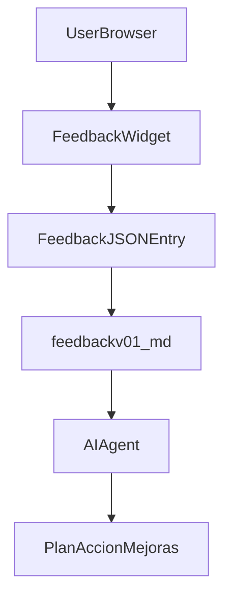

## ChronoProtein · Radiografía y sistema de feedback (06-mar-2026)

Este documento resume el estado actual de la web app **ChronoProtein**, identifica oportunidades de mejora y define el diseño funcional y técnico de un **sistema de feedback** de usuarios, incluyendo el formato del archivo `feedbackv01.md` pensado para ser consumido por IA.

---

## 1. Radiografía de la app actual

### 1.1 Arquitectura general

- **Modelo de app**: aplicación web estática compuesta por varias páginas HTML que comparten un diseño y una capa de lógica en JavaScript.
- **Páginas principales**:
  - `index.html`: landing/portada. Presenta el concepto de Chrono-Nutrition, las features clave y tiene CTAs para:
    - Construir el protocolo personalizado (`onboarding.html`).
    - Ver la explicación científica (`metabolic-windows.html`).
  - `onboarding.html`: wizard de **5 pasos** donde el usuario completa:
    - Métricas corporales (peso, edad, sexo, % grasa opcional).
    - Cronotipo (quiz de 3 preguntas).
    - Objetivo (wellness, mantenimiento, ganar músculo, recomposición, resistencia, healthy aging).
    - Actividad y dieta (nivel de actividad, tipo de dieta, días de entrenamiento, hora típica).
    - Resumen y generación de protocolo.
    - Al finalizar, se genera un perfil y plan personalizados y se guardan en `localStorage` como `chronoProfile` y `chronoPlan`.
  - `dashboard.html`: muestra el **plan diario personalizado**:
    - Si no existe plan en `localStorage`, muestra estado “NO PROTOCOL YET” y un botón para ir a `onboarding.html`.
    - Si hay plan:
      - Cabecera con `MY PLAN`, badges de **cronotipo** y **objetivo**.
      - Selector de día (`Training Day` / `Rest Day`).
      - Bloque `DAILY TARGETS` con números clave (gramos día, g/kg, comidas, leucina/meal, peso, masa magra).
      - **Timeline 24h** de ventanas de proteína.
      - Tarjetas de **protein windows** con gramos, clase de proteína (A–E), chequeo de leucina y ejemplos de comidas.
  - `metabolic-windows.html`: página educativa de “Metabolic Windows” con gráficos y texto sobre la cascada metabólica post-entrenamiento, ventanas catabólicas/anabólicas, umbrales de proteína y leucina, etc. Usa el mismo design system.
  - `auth.html`: pantalla de autenticación (Sign In / Sign Up) para guardar planes y acceder desde cualquier dispositivo. Integra con Supabase vía `js/supabase-client.js`.
  - `admin.html`: panel de administración para ver usuarios registrados y algunos datos (cronotipo, objetivo, peso, etc.).

### 1.2 Capa de diseño (CSS)

- Hoja central: `css/design-system.css`.
- Define:
  - **Tokens de color** (rojo, naranja, ámbar, verde, teal, fondos oscuros, bordes, texto, etc.).
  - Colores específicos para las **clases de proteína A–E**.
  - Spacing scale, tipografías (`Bebas Neue`, `DM Sans`, `DM Mono`).
  - Componentes reutilizables:
    - `btn`, `btn-primary`, `btn-secondary`, `btn-lg`.
    - `card`, `card-alt`, `badge` + variantes (`badge-anabolic`, `badge-catabolic`, etc.).
    - `input-group` para formularios.
    - `timeline-bar`, clases de wizard de pasos, animaciones `fadeUp`, etc.
- Conclusión: el diseño está **altamente unificado** y es un buen lugar para colgar el widget de feedback sin romper la estética.

### 1.3 Lógica de negocio en JavaScript

- `js/chronotype.js`
  - Implementa `ChronoQuiz`:
    - 3 preguntas (`wake`, `peak`, `exercise`) puntuadas 1–5.
    - Suma total (3–15) → clasifica en `morning`, `intermediate`, `evening`.
    - Devuelve también etiqueta (`Morning Type`, etc.) y descripción de cada cronotipo.
- `js/calculator.js`
  - Implementa `ChronoCalculator`:
    - Usa multiplicadores de proteína por kg según el **objetivo** (wellness, maintenance, etc.) y modifica según nivel de actividad.
    - Calcula:
      - `proteinPerKg`.
      - `dailyTotalG` (gramos totales día).
      - `perMealMinG` (~0.4 g/kg).
      - Umbral de leucina por edad (`leucinePerMealG`).
    - Carga un esquema de ventanas por cronotipo y día (`training` / `rest`) desde datos embebidos (equivalentes a `data/chronotype-schedules.json`).
    - Construye las **ventanas de proteína**:
      - Asigna gramos por ventana (`share` del total).
      - Ajusta la **clase de proteína** (A–E) según tipo de dieta (`omnivore`, `vegetarian`, `vegan`).
      - Estima leucina y marca si la ventana supera el umbral (`leucineOk`) o necesita suplemento (clase C).
- `js/schedule-builder.js`
  - Módulo `ScheduleBuilder`:
    - `renderSummary(plan, containerId)`: muestra stats diarios.
    - `renderTimeline(plan, containerId)`: construye barra 24h con las ventanas en orden temporal.
    - `renderWindowCards(plan, containerId)`: genera tarjetas por ventana con:
      - Hora, gramos, clase A–E, share del día.
      - Badge de leucina `OK` o `LOW` con detalles.
      - Lista de **ejemplos de comidas** con gramos de proteína y notas.
    - Expone también `CLASS_COLORS` y `WINDOW_ICONS`.
- `js/protein-classes.js`
  - Módulo `ProteinClasses`:
    - Define propiedades detalladas de cada clase A–E (nombre, absorción, leucine %, mejores ventanas, fuentes de alimentos, etc.).
    - Provee `recommendClass(windowKey, dietType)` y `checkLeucine(gramsProtein, classId, ageBasedThreshold)`.
- `js/i18n.js`
  - Módulo `I18n`:
    - Traducciones completas en **inglés** (`en`) y **español** (`es`) para todas las pantallas actuales.
    - Guarda el idioma en `localStorage` bajo `chronoLang`.
    - Expone `I18n.setLang`, `I18n.getLang` y una función global `i18n(key)` que resuelve la clave al idioma actual con fallback a EN.
    - Los HTML usan atributos `data-i18n` y `data-i18n-html` para aplicar textos.
- `js/supabase-client.js`
  - Cliente pensado para autenticación y panel de admin usando Supabase (no se detalla aquí porque el sistema de feedback inicial no depende de él directamente, pero es un potencial canal futuro para almacenar feedback).

### 1.4 Flujo de usuario actual (alto nivel)

1. El usuario llega a `index.html`:
   - Puede cambiar idioma (EN/ES) con el toggle fijo.
   - Lee el hero, las features y las “protein classes”.
   - Tiene CTAs:
     - `Build My Protocol` → `onboarding.html`.
     - `See the Science` → `metabolic-windows.html`.
2. En `onboarding.html`:
   - Completa los 5 pasos del wizard.
   - Se calcula su plan con `ChronoCalculator`.
   - Se guarda en `localStorage`:
     - `chronoProfile`: datos del perfil.
     - `chronoPlan`: plan calculado.
   - Se redirige a `dashboard.html`.
3. En `dashboard.html`:
   - Si no existe plan:
     - Muestra sección “NO PROTOCOL YET” con botón hacia `onboarding.html`.
   - Si existe plan:
     - Muestra dashboard con targets, timeline y ventanas, diferenciando `Training Day` y `Rest Day`.
4. Opcionalmente:
   - `auth.html` permite sign in/up para guardar planes en backend.
   - `admin.html` permite ver usuarios y algunos atributos agregados.

### 1.5 Internacionalización

- `js/i18n.js` centraliza todas las cadenas de texto en mapas `en` y `es`.
- Las páginas HTML:
  - Marcan los elementos traducibles con `data-i18n="clave"` o `data-i18n-html="clave"`.
  - Al cambiar idioma con el toggle:
    - Se actualizan las clases `active` de los botones de idioma.
    - Se recorre el DOM y se reemplaza el contenido textual con `i18n(clave)`.
- El sistema está listo para agregar nuevas claves para el módulo de feedback sin cambiar la arquitectura.

### 1.6 Persistencia y datos

- `localStorage`:
  - `chronoLang`: idioma actual del usuario.
  - `chronoProfile`: perfil generado por el wizard.
  - `chronoPlan`: plan generado por el motor de cálculo.
- Archivos de datos:
  - `data/chronotype-schedules.json`: define ventanas por cronotipo (reflejado también inline en `js/calculator.js`).
  - `data/protein-foods.json`: base de alimentos y valores de leucina/proteína por clase (usado para ejemplos/sugerencias).
  - `data/supabase-setup.sql`: script de configuración de tablas para Supabase (usuarios, perfiles, etc.), posible backend futuro para almacenar feedback y otros datos.

---

## 2. Observaciones y oportunidades de mejora

### 2.1 UX / flujo

- Actualmente no existe un **canal claro de feedback in-app**:
  - Los usuarios no tienen un lugar visible para:
    - Reportar bugs o errores de cálculo/visualización.
    - Proponer mejoras de UX, flujo o contenido.
    - Destacar lo que más valoran del producto (feedback positivo).
- Esto limita la capacidad de:
  - Detectar fricción real en el onboarding o dashboard.
  - Priorizar mejoras desde la perspectiva del usuario.
  - Recolectar testimonios o señales de “qué está funcionando bien”.

### 2.2 Consistencia visual

- El design system es consistente y robusto:
  - Misma tipografía, colores y componentes en landing, onboarding, dashboard y páginas educativas.
- Oportunidad:
  - Diseñar el componente de feedback (botón flotante + modal) usando:
    - Tokens de color existentes (`--green`, `--teal`, `--card`, `--border`).
    - Componentes `btn`, `input-group`, `badge`.
  - De esta forma el feedback se sentirá nativo de la app, no un injerto.

### 2.3 Arquitectura y código

- La lógica de negocio está bien modularizada (`ChronoCalculator`, `ScheduleBuilder`, `ProteinClasses`, `I18n`).
- Oportunidad:
  - Implementar el feedback como **otro módulo JS autónomo**, por ejemplo `js/feedback.js`, que:
    - No mezcle su lógica con el motor de cálculo ni con el wizard.
    - Se limite a UI + serialización en el formato de `feedbackv01.md`.

### 2.4 Localización / idioma

- El sistema de i18n ya está operativo.
- Nuevo contenido (feedback) debe:
  - Definirse con claves claras en `js/i18n.js`, ej.:
    - `feedbackButtonLabel`, `feedbackTitle`, `feedbackTypeBug`, `feedbackTypeImprovement`, `feedbackTypePositive`, `feedbackPlaceholder`, `feedbackNameLabel`, `feedbackEmailLabel`, `feedbackOptional`, `feedbackSubmit`, `feedbackSuccess`, `feedbackError`.
  - Usar exclusivamente `i18n(key)` para textos, manteniendo coherencia EN/ES.

---

## 3. Diseño funcional del sistema de feedback

### 3.1 UX y ubicación del botón

- **Widget flotante de feedback**:
  - Botón flotante fijo en la **esquina inferior derecha**, por encima del contenido.
  - Se muestra en las vistas clave:
    - `index.html` (landing).
    - `onboarding.html` (wizard).
    - `dashboard.html` (plan diario).
    - `metabolic-windows.html` (ciencia).
    - Opcionalmente `auth.html` y `admin.html` (se podrá activar/desactivar por config).
- Comportamiento:
  - Estado por defecto: botón comprimido tipo **FAB** (`feedback-fab`) con icono y texto corto (`Feedback` / `Feedback` ES/EN).
  - Al hacer clic:
    - Se abre un **panel/modal de feedback**:
      - Con backdrop semitransparente (`feedback-backdrop`) que oscurece ligeramente el fondo.
      - Caja centrada (`feedback-modal`) con formulario.
  - En mobile:
    - Margen inferior y derecho suficientes para no solaparse con barras del sistema o otros botones fijos.
    - Posible altura máxima con scroll interno del formulario para evitar desbordes.

### 3.2 Contenido del formulario de feedback

Campos previstos (alineados con lo que pediste):

- **Tipo de feedback** (selector):
  - Opciones:
    - `bug` (problema / error).
    - `improvement` (mejora o idea).
    - `positive` (algo que le gustó / elogio).
  - UI: select o grupo de botones tipo pills dentro del modal (`badge` o mini-cards).
- **Descripción libre** (textarea requerido):
  - El usuario explica:
    - Qué vio (bug, mejora sugerida o punto positivo).
    - Opcionalmente pasos para reproducir un bug.
  - Validaciones mínimas:
    - No permitir enviar vacío.
    - Longitud máxima razonable (p.ej. 2000 caracteres).
- **Contexto opcional**:
  - Campo no editable que el sistema completa automáticamente:
    - `page`: ruta de la página actual (`window.location.pathname`), visible en el modal como “Estás enviando feedback sobre: dashboard.html”.
  - Futuro (opcional, no requerido para v1):
    - Adjuntar una mini ficha de contexto de usuario (por ejemplo cronotipo y objetivo leídos de `chronoProfile`) solo si se considera relevante y se comunica claramente a la persona.
- **Identificación del usuario**:
  - Nombre o alias (campo de texto):
    - Puede marcarse como recomendado pero no estrictamente obligatorio, según preferencia.
  - Email **opcional**:
    - Campo de texto con validación de formato básico.
    - Etiqueta clara indicando “opcional”, para que la persona sepa que no es requerido.

Estados de UI:

- **Inicial**:
  - Todos los campos vacíos (excepto el tipo por defecto y la página).
  - Botón de enviar habilitado solo si la descripción tiene contenido.
- **Envío en curso**:
  - Botón de enviar deshabilitado y muestra un texto tipo “Enviando…” / “Sending…”.
- **Éxito**:
  - Mostrar mensaje de agradecimiento:
    - Ej.: “Gracias por tu feedback, nos ayuda a mejorar ChronoProtein.”
  - Opción de cerrar el modal o enviar otro feedback.
- **Error**:
  - En caso de fallo de envío (cuando exista backend/script):
    - Mensaje de error y opción de reintentar.

### 3.3 Integración con i18n

El formulario usará exclusivamente claves de `i18n` para sus textos. Ejemplos de claves:

- Botón y título:
  - `feedbackButtonLabel`: “Feedback” / “Feedback”.
  - `feedbackTitle`: “Send Feedback” / “Enviar feedback”.
- Campos:
  - `feedbackType`: “Type” / “Tipo”.
  - `feedbackTypeBug`: “Bug / Issue” / “Bug / Problema”.
  - `feedbackTypeImprovement`: “Improvement Idea” / “Mejora / Idea”.
  - `feedbackTypePositive`: “Positive Highlight” / “Algo positivo”.
  - `feedbackDescriptionLabel`: “Describe what you saw” / “Describí lo que viste”.
  - `feedbackDescriptionPlaceholder`: textos de ayuda en cada idioma.
  - `feedbackNameLabel`: “Name or alias” / “Nombre o alias”.
  - `feedbackEmailLabel`: “Email (optional)” / “Email (opcional)”.
  - `feedbackPageLabel`: “Current page” / “Página actual”.
- Botones y mensajes:
  - `feedbackSubmit`: “Send Feedback” / “Enviar feedback”.
  - `feedbackCancel`: “Cancel” / “Cancelar”.
  - `feedbackSuccess`: mensajes de agradecimiento.
  - `feedbackError`: mensaje de error genérico.

---

## 4. Diseño técnico del archivo `feedbackv01.md`

El archivo `feedbackv01.md` será el **repositorio central** de todas las devoluciones que recibe la app, en un formato pensado para ser consumido por IA.

### 4.1 Estructura general del archivo

- Ubicación recomendada:
  - Raíz del proyecto (`feedbackv01.md`) para visibilidad rápida.
  - Alternativa futura: moverlo a `data/feedbackv01.md` si se prefiere separar datos de código.
- Cabecera del archivo (texto en markdown) explicando:
  - Propósito: “Archivo de feedback recolectado desde la app ChronoProtein”.
  - Formato: “Cada feedback se almacena como un bloque JSON independiente dentro de un bloque de código markdown”.
  - Uso esperado: “Este archivo está diseñado para que una IA lo lea y genere planes de acción de mejora”.

### 4.2 Formato de cada entrada

Cada feedback se representa como un bloque JSON completo dentro de un bloque de código markdown:

```markdown
```json
{
  "id": "uuid-o-timestamp",
  "timestamp": "2026-03-06T12:34:56Z",
  "page": "dashboard.html",
  "type": "bug",
  "message": "Texto libre del feedback...",
  "user": {
    "name": "Nombre o alias",
    "email": "usuario@example.com"
  }
}
```
```

Notas:

- Las entradas se van agregando **una debajo de la otra**, cada una en su bloque ` ```json ... ``` `.
- El campo `type` será uno de:
  - `"bug"`, `"improvement"`, `"positive"`.
- Esto simplifica el procesamiento automático:
  - Una IA puede buscar todos los bloques de código etiquetados como `json`.
  - Parsear cada objeto y agrupar por `type`, `page`, fecha, etc.

### 4.3 Campos mínimos obligatorios y opcionales

- Campos obligatorios:
  - `id`:
    - Identificador único por feedback.
    - Puede generarse como combinación de timestamp + un sufijo aleatorio (ej. `"2026-03-06T12:34:56Z-abc123"`).
  - `timestamp`:
    - Fecha/hora de creación en formato ISO8601 (UTC o con offset).
  - `page`:
    - Ruta de la página desde la que se envía el feedback.
    - Ejemplos: `"index.html"`, `"onboarding.html"`, `"dashboard.html"`, `"metabolic-windows.html"`.
  - `type`:
    - `"bug"`, `"improvement"` o `"positive"`.
  - `message`:
    - Texto libre con la descripción que escribió el usuario.
- Campos opcionales recomendados:
  - `user.name`:
    - Nombre o alias proporcionado.
  - `user.email`:
    - Email si la persona decidió compartirlo, o `null` si lo dejó vacío.
  - Futuro (opt-in):
    - `profileSnapshot`:
      - Objeto pequeño con datos agregados del perfil (por ejemplo `chronotype`, `goal`, `weightKg`), solo si se decide guardar ese contexto y se informa al usuario.

---

## 5. Diseño técnico del módulo de feedback (sin implementarlo aún)

Este apartado deja escrito el blueprint para la futura implementación de `js/feedback.js` y su integración en las páginas, sin tocar aún los HTML ni el CSS.

### 5.1 Módulo `js/feedback.js`

- Patrón propuesto:

  - Archivo: `js/feedback.js`.
  - Estructura:
    - IIFE que encapsula la lógica:
      - `const Feedback = (() => { ... return { init }; })();`
    - API pública mínima:
      - `Feedback.init()`:
        - Inyecta el botón flotante (`feedback-fab`) en el DOM.
        - Prepara el modal y listeners de apertura/cierre.
        - Lee idioma actual con `I18n.getLang()` y usa `i18n(key)` para textos.

- Responsabilidades internas:

  - **Render del botón flotante**:
    - Crear un elemento `<button>` o `<div>` con clase `feedback-fab`.
    - Insertarlo al final de `<body>` para que quede por encima del resto.
  - **Render del modal/panel**:
    - Crear nodos DOM para:
      - `feedback-backdrop`.
      - Contenedor `feedback-modal` con formulario.
    - Ocultarlos por defecto y mostrarlos al hacer clic en el FAB.
  - **Gestión de estado del formulario**:
    - Manejar cambios de tipo de feedback, llenado de descripción, nombre, email.
    - Validar antes de enviar (al menos descripción no vacía).
  - **Serialización de feedback**:
    - Construir un objeto JS con la forma:

      ```js
      {
        id,
        timestamp,
        page,
        type,
        message,
        user: { name, email }
      }
      ```

    - Convertirlo a JSON (`JSON.stringify`) para luego volcarlo en el archivo `feedbackv01.md` mediante herramientas externas.

- Limitación importante en esta fase:

  - Desde el navegador no se puede escribir directamente en `feedbackv01.md` en el filesystem del servidor sin un backend.
  - Por eso, la primera versión se centra en:
    - Definir el formato y la serialización.
    - Permitir logging a consola o envío a una API cuando exista.

- Opciones futuras para persistencia real:

  - **Opción A: Script de dev (Node)**:
    - Mientras se trabaja localmente, usar una pequeña API (por ejemplo, un server Node/Express) que reciba el JSON y lo agregue a `feedbackv01.md`.
  - **Opción B: Supabase / backend**:
    - Guardar feedback en una tabla de Supabase con columnas equivalentes a los campos JSON.
    - Periódicamente exportar el contenido como `feedbackv01.md` usando un script que convierta filas a bloques JSON dentro de un archivo markdown.

### 5.2 Integración HTML del módulo

- Páginas donde se incluirá el script `js/feedback.js`:
  - `index.html`
  - `onboarding.html`
  - `dashboard.html`
  - `metabolic-windows.html`
  - Opcionalmente:
    - `auth.html`
    - `admin.html`
- Forma de inclusión (a futuro):
  - Al final del `<body>` de cada página, después de `js/i18n.js` y scripts específicos de la vista:

    ```html
    <script src="js/feedback.js"></script>
    <script>
      Feedback.init();
    </script>
    ```

### 5.3 Estilos del widget de feedback

- Nuevas clases propuestas en `css/design-system.css`:

  - `feedback-fab`:
    - Botón flotante redondeado:
      - Posición `fixed`, `bottom: 20px`, `right: 20px`.
      - Fondo con gradiente similar a `btn-primary`.
      - Elevación (sombra) ligera.
      - Usa tipografía `var(--font-body)` y colores de tokens existentes.
  - `feedback-backdrop`:
    - Cubre la pantalla completa:
      - `position: fixed`, `inset: 0`.
      - Fondo `rgba(0,0,0,0.6)`.
  - `feedback-modal`:
    - Caja centrada:
      - Máximo ancho razonable (ej. 420–480 px).
      - `background: var(--card)`, borde `var(--border)`, `border-radius: var(--radius-lg)`.
      - Internamente reutiliza `input-group`, `btn`, etc.
  - `feedback-form`:
    - Layout del formulario con spacing consistente (`var(--sp-md)`).

- Responsividad:
  - En pantallas pequeñas:
    - El modal puede ocupar casi todo el ancho y alto (`max-width: 100%; max-height: 90vh; overflow-y: auto`).
    - El FAB puede subir unos pixeles (`bottom: 80px`) si hubiese otros elementos fijos.

---

## 6. Cómo una IA procesará `feedbackv01.md`

Un agente de IA podrá usar `feedbackv01.md` como fuente estructurada para generar un plan de acción de mejoras.

Pasos típicos:

1. **Lectura del archivo**:
   - Cargar el contenido de `feedbackv01.md`.
2. **Extracción de entradas**:
   - Buscar todos los bloques de código con lenguaje `json`.
   - Parsear cada bloque como un objeto JSON independiente.
3. **Normalización y agrupamiento**:
   - Agrupar por:
     - `type` (`bug`, `improvement`, `positive`).
     - `page` (`index.html`, `onboarding.html`, etc.).
     - Rango de fechas (`timestamp`).
   - Opcionalmente cruzar con otros datos (por ejemplo, cronotipo/objetivo) si se incluyen en el futuro.
4. **Generación de plan de acción**:
   - Construir un documento de salida (p.ej. `plan-mejoras-YYYY-MM-DD.md`) con secciones:
     - Bugs críticos (ordenados por frecuencia y páginas afectadas).
     - Mejoras de UX / flujo (ordenadas por impacto percibido).
     - Oportunidades de educación/copy (sugerencias de contenido extra o aclaraciones).
     - Puntos positivos a preservar (features que los usuarios elogian).

Diagrama de flujo (con Mermaid) del circuito de feedback:



---

## 7. Próximos pasos de implementación (checklist)

Estos pasos NO se ejecutan en este archivo, solo se listan para tener una guía clara cuando se vaya a implementar el sistema de feedback.

- [ ] Crear `js/feedback.js` con:
  - FAB flotante (`feedback-fab`).
  - Modal de feedback (`feedback-modal` + `feedback-backdrop` + `feedback-form`).
  - Serialización de feedback a objetos JSON con el formato definido.
- [ ] Extender `js/i18n.js` con las claves de textos de feedback en EN/ES.
- [ ] Incluir `<script src="js/feedback.js"></script>` y llamada a `Feedback.init()` en:
  - `index.html`
  - `onboarding.html`
  - `dashboard.html`
  - `metabolic-windows.html`
  - (Opcional) `auth.html`, `admin.html`
- [ ] Diseñar y agregar estilos del widget de feedback en `css/design-system.css` usando los tokens existentes.
- [ ] Diseñar el pipeline para volcar los envíos al archivo `feedbackv01.md`:
  - Script Node/API local para desarrollo.
  - O integración con Supabase u otro backend + script de exportación a markdown.

